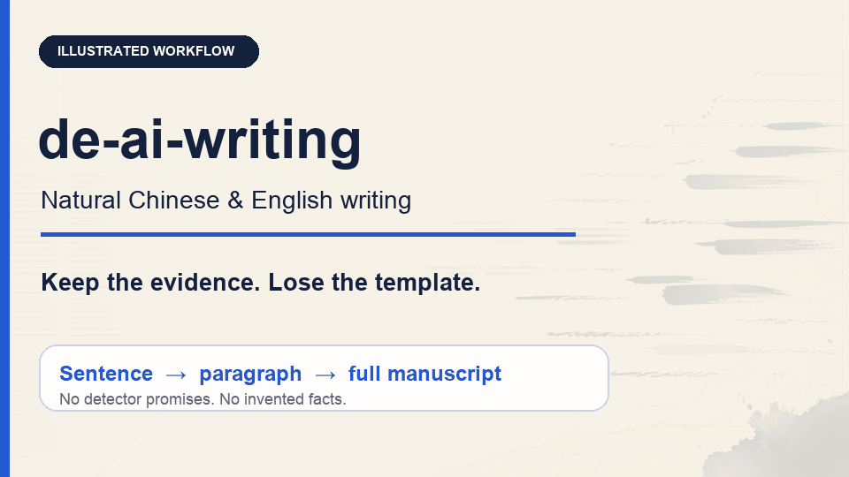

<div align="center">


# de-ai-writing

**A bilingual Agent Skill for natural, specific, authorial writing—without changing the evidence.**

[简体中文](README.zh-CN.md) · [Examples](examples/README.md) · [Install](docs/installation.md) · [Privacy](docs/privacy.md) · [Issues](https://github.com/qiyanghong2020/de-ai-writing/issues)

[](https://github.com/qiyanghong2020/de-ai-writing/stargazers)
[](https://github.com/qiyanghong2020/de-ai-writing/releases)
[](https://github.com/qiyanghong2020/de-ai-writing/actions/workflows/validate.yml)
[](https://skills.sh/qiyanghong2020/de-ai-writing)
[](LICENSE)

</div>

`de-ai-writing` revises Chinese and English prose that feels over-structured, generic, repetitive, translation-shaped, or machine-smoothed. It handles academic and medical manuscripts, theses, emails, applications, reports, product documents, and long conceptual papers.

It is not a detector bypass or a synonym spinner. Facts, numbers, citations, uncertainty, genre, and author intent are protected throughout the edit.

## See the workflow

<div align="center">

</div>

The demo uses synthetic material. No manuscript was uploaded to produce it.

## Why this skill is different

| Common humanizer behavior | `de-ai-writing` |
| --- | --- |
| Replaces suspicious words and connectors | Diagnoses lexical, structural, tonal, and evidence problems in context |
| Produces one generic “human” voice | Uses separate Chinese and English lanes and preserves legitimate World English |
| Optimizes for a detector score | Preserves claims and uncertainty; makes no detector-evasion promise |
| Stops at the paragraph | Audits cross-section repetition, rhetorical closure, and low analytical increment |
| Deletes neat frameworks as “AI-like” | Keeps a taxonomy when its categories change interpretation, evaluation, or action |

## Quick start

Install with the open-source `skills` CLI:

```bash
npx skills add qiyanghong2020/de-ai-writing -g
```

Or install for Codex, Claude Code, and Cursor in one command:

```bash
npx skills add qiyanghong2020/de-ai-writing \
  -g -a codex -a claude-code -a cursor -y
```

See the [cross-agent installation guide](docs/installation.md) for manual paths, project-level installs, updates, and invocation details.

## Use it

### General rewrite

```text
Use de-ai-writing to revise this draft so it sounds natural and specific while preserving every fact, citation, number, and limitation.
```

### Chinese medical or academic writing

```text
请使用 de-ai-writing 修改这段中文讨论。减少翻译腔、抽象套话和模板化连接词，但不要改变证据强度、统计量和医学术语。
```

### English manuscript editing

```text
Use de-ai-writing to edit this manuscript paragraph for natural academic English. Preserve the author's World English register and do not strengthen the claims.
```

### Long Viewpoint or framework paper

```text
Use de-ai-writing to audit this full Viewpoint before rewriting. Map where the central thesis recurs, inventory gates/states/tiers/frameworks, identify sections with low analytical increment, and propose compression without deleting necessary Methods, Results, definitions, limitations, or Introduction–Conclusion correspondence.
```

Invoke it as `$de-ai-writing` in Codex or `/de-ai-writing` in Claude Code and Cursor. Automatic discovery can also apply it when the request matches the skill description.

## Worked examples

All examples are synthetic and show the protected facts, diagnosis, revision, and deliberate non-edits.

| Example | Decision demonstrated |
| --- | --- |
| [English academic paragraph](examples/01-english-academic.md) | Keeps an observational association below the causal ceiling |
| [English workplace email](examples/02-english-email.md) | Makes the ask and deadline visible without becoming abrupt |
| [Chinese medical discussion](examples/03-chinese-medical.md) | Preserves sample size, effect estimate, interval, and design limit |
| [Chinese workplace email](examples/04-chinese-workplace-email.md) | Removes procedural padding while keeping professional respect |
| [30-page Viewpoint audit](examples/05-viewpoint-structural-audit.md) | Maps thesis recurrence and merges decorative concept labels |
| [Taxonomy negative control](examples/06-taxonomy-preservation.md) | Retains categories with independent decision consequences |
| [World English preservation](examples/07-world-english.md) | Improves clarity without erasing a setting-specific register |

## How it works

1. **Lock meaning.** Protect claims, figures, sources, comparison direction, and uncertainty.
2. **Choose the lane.** Use Chinese, English, medical/thesis, or long-document guidance only when relevant.
3. **Diagnose before rewriting.** Identify whether the problem is lexical, structural, tonal, evidentiary, or a loss of author voice.
4. **Rewrite at the right scale.** Edit the local block, or—when authorized—compress document-level repetition before line editing.
5. **Run the human pass.** Check that the result is plausible for the genre and has not invented detail or strengthened a claim.

Detailed rules stay in `references/` so agents load them progressively instead of placing a large tutorial in `SKILL.md`.

## Long-manuscript structural audit

For an authorized full-paper edit, the skill can:

- summarize the central thesis in one sentence;
- build a thesis-recurrence map across sections;
- test whether each recurrence adds evidence, a qualification, a counterargument, an operational consequence, a new inference, or a failure boundary;
- inventory labels such as `framework`, `boundary`, `gate`, `tier`, `state`, `class`, `level`, `matrix`, and `model`;
- give each section one distinct job;
- compress low-increment repetition before sentence-level polishing.

It does not mechanically delete taxonomies, definitions, Methods, Results, limitations, or normal Abstract–Introduction–Conclusion correspondence. See the [complete Viewpoint example](examples/05-viewpoint-structural-audit.md) and the [taxonomy preservation case](examples/06-taxonomy-preservation.md).

## Privacy

This repository is a local set of instructions and references. It does not host a rewriting service or collect manuscript text. The agent and model you choose may process your text under their own policies.

Do not paste unpublished manuscripts, patient identifiers, confidential peer review, credentials, or legally sensitive text into an unreviewed third-party demo. A hosted demo should be linked only after its operator, model subprocessors, retention, training use, deletion route, and incident responsibility are documented. Read the [privacy guidance](docs/privacy.md).

## Validation

Run the repository contract tests:

```bash
python -m unittest discover -s tests -v
```

Inspect portable Agent Skills discovery without installing:

```bash
npx skills add . --list
```

The test suite checks frontmatter, reference paths, safeguards, example coverage, document-level audit concepts, local links, and machine-readable behavior expectations. It does not call an AI detector or modify user documents.

## Repository map

```text
de-ai-writing/
├── SKILL.md                 # routing and core safeguards
├── references/              # Chinese, English, medical, and long-document guidance
├── examples/                # seven complete worked cases
├── tests/                   # contract tests and behavior expectations
├── docs/                    # installation and privacy guidance
├── assets/                  # social preview and illustrated demo
└── agents/openai.yaml       # Codex interface metadata
```

## Boundaries

- Final prose style cannot establish whether a person or model wrote a passage.
- AI-detector output is not conclusive evidence.
- Disclosure questions must be assessed from the actual workflow and the target journal or institution's policy.
- A paragraph-level request does not authorize an unsolicited full-manuscript restructure.
- Users remain responsible for verifying revised text before submission or publication.

## Contributing

Issues and pull requests are welcome, especially for:

- fact-preserving Chinese or English examples;
- false positives in academic, medical, technical, or professional writing;
- legitimate taxonomies or necessary repetition that should be preserved;
- reproducible long-document edge cases and behavior tests.

Do not submit rules whose only goal is to manipulate an AI-detector score. See the [design provenance](UPSTREAM.md) for earlier influences and rejected tactics.

## License

Released under the [MIT License](LICENSE).

---

If this skill helps you keep the substance while losing the template, [star the repository](https://github.com/qiyanghong2020/de-ai-writing) and share one example that challenged it.
